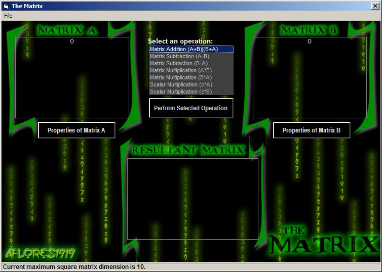



## The Matrix

### Description

A simple program on matrices and its operations (Matrix addition, subtraction, multiplication and scalar multiplication). Supports a dynamic allocation of matrix dimensions and elements. Utilizes the use of different operations on matrices and is dictated by the rules of the proper computation of these operations.
 
### More Info
 

             |
---                |---
**Submitted On**   |2006-05-06 23:10:10
**By**             |[Jeshurun Ray Flores](https://github.com/Planet-Source-Code/PSCIndex/blob/master/ByAuthor/jeshurun-ray-flores.md)
**Level**          |Beginner
**User Rating**    |5.0 (10 globes from 2 users)
**Compatibility**  |VB 6\.0
**Category**       |[Complete Applications](https://github.com/Planet-Source-Code/PSCIndex/blob/master/ByCategory/complete-applications__1-27.md)
**World**          |[Visual Basic](https://github.com/Planet-Source-Code/PSCIndex/blob/master/ByWorld/visual-basic.md)
**Archive File**   |[The\_Matrix199261572006\.zip](https://github.com/Planet-Source-Code/jeshurun-ray-flores-the-matrix__1-65256/archive/master.zip)

